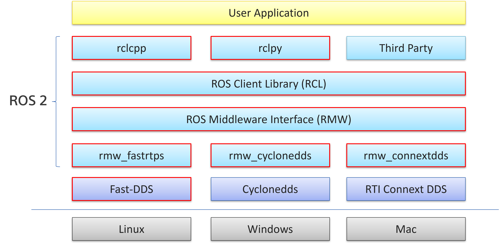
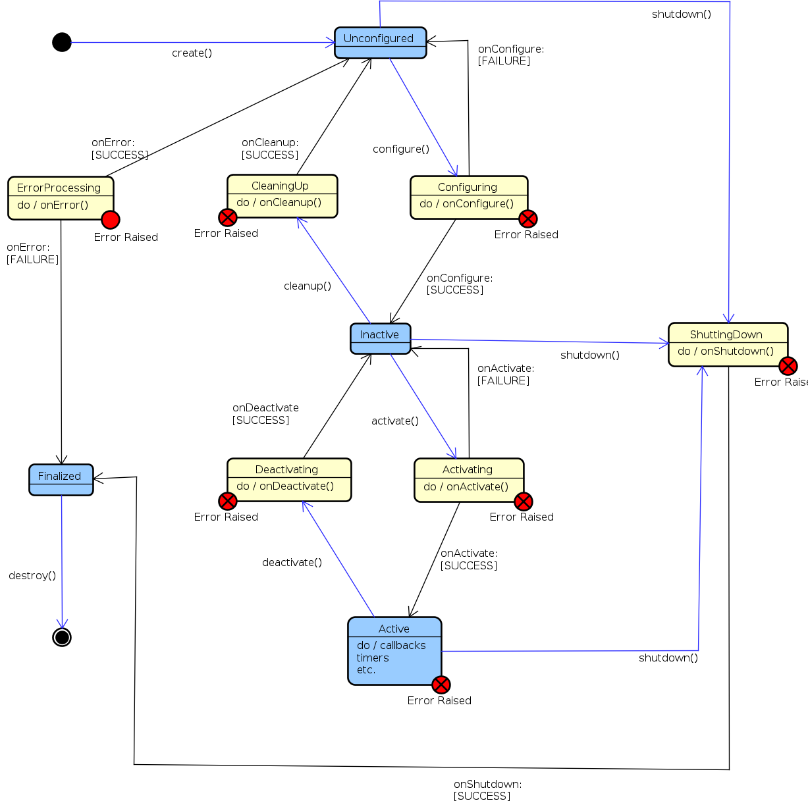
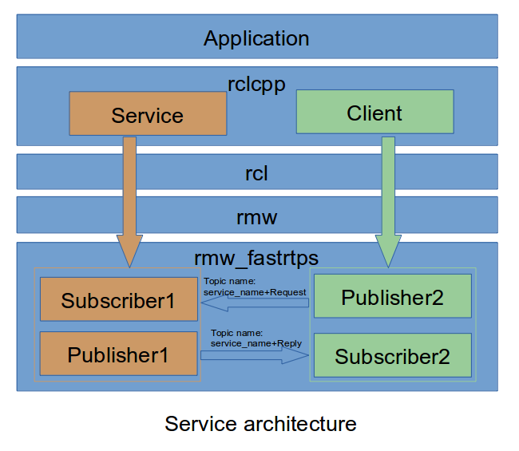
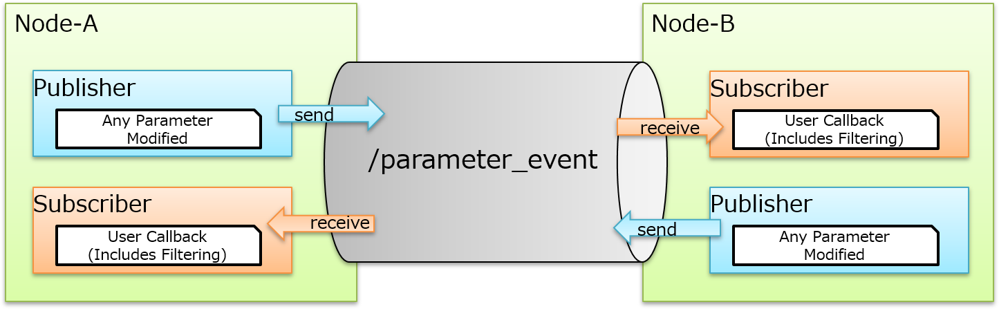
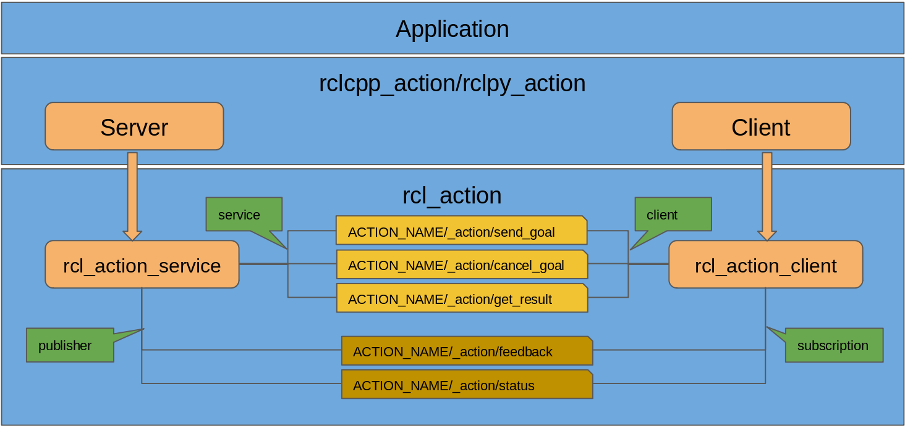
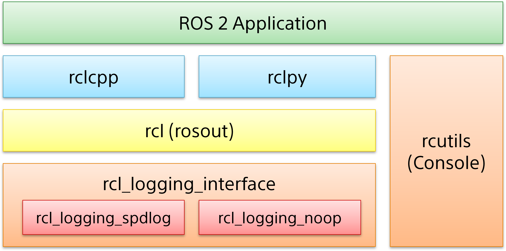
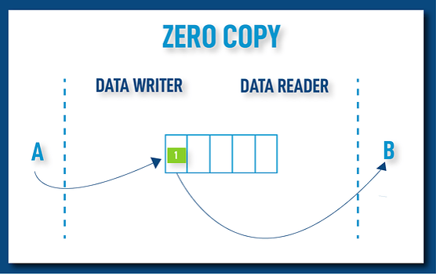
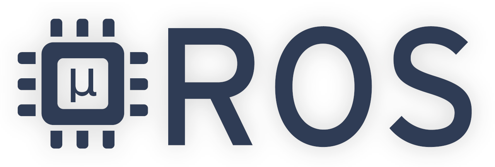

# ROS 2 Core Overview

This is meant to explain ROS 2 core basics, design, and features.
Our centralized mainline documentation site is [ROS 2 documentation](https://docs.ros.org/) if we need to know more details.

<!---
Comment here
--->

---

# Agenda

- Governance
- Distributions
- Architecture / Design
- Basic Concepts
- Features

<!---
Comment here
--->

---

# Governance

## [Open Source Robotics Alliance](https://osralliance.org/)

is a new initiative of the OSRF to organize and strengthen project governance and community involvement. The OSRA is a mixed membership and meritocratic model, following other successful foundations for open-source projects.

<!---
Comment here
--->

---

## [ROS Project Management Committee](https://docs.ros.org/en/rolling/The-ROS2-Project/Governance.html#the-ros-project-management-committee-ros-pmc)

The ROS Project Management Committee is responsible for the day-to-day operations of the ROS 2 project. The ROS PMC consists of the Project Leader, the ROS PMC Members (who have full voting rights)

See [Current ROS PMC Constituents](https://docs.ros.org/en/rolling/The-ROS2-Project/Governance.html#current-ros-pmc-constituents).

<!---
Comment here
--->

---

## Community Sites

- [ROS 2 Github](https://github.com/ros2)
  - Development, Design, Source code
- [ROS Discourse](https://discourse.ros.org/)
  - Discussion / Announcement / Release
- [Robotics Stack Exchange](https://robotics.stackexchange.com/)
  - Centralized QA platform
- Working Group / Specific Interest Group
  - Under construction since OSRA structure transition.

<!---
Comment here
--->

---

# [Distributions](https://docs.ros.org/en/rolling/Releases.html)

| Distribution Name | Release Date   | End Of Life Date |
| :---------------- | :------------- | :--------------- |
| Lyrical Luth      | May 2026       | May 2031         |
| Kilted Kaiju      | May 2025       | November 2026    |
| Jazzy Jalisco     | May 23rd, 2024 | May 2029         |
| Iron Irwini       | May 23rd, 2023 | November 2024    |
| Humble Hawksbill  | May 23rd, 2022 | May 2027         |

<!---
Comment here
--->

---

<!---
Comment here
--->

---

# Data Distribution Service

The **OMG Data-Distribution Service for Real-Time Systems® (DDS®)** is the first open international middleware standard directly addressing publish-subscribe communications for real-time and embedded systems.

DDS introduces a virtual **Global Data Space** where applications can share information by simply reading and writing **data-objects** addressed by means of an application-defined name (Topic) and a key. DDS features fine and extensive control of **QoS** parameters, including reliability, bandwidth, delivery deadlines, and resource limits. DDS also supports the construction of **local object models** on top of the Global Data Space.

<!---
Comment here
--->

---

# [Zenoh](https://github.com/eclipse-zenoh/zenoh)

New Tier 1 RMW implementation.

Zenoh (pronounced /zeno/) unifies data in motion, data at rest, and computations. It carefully blends traditional pub/sub with geo-distributed storage, queries, and computations, while retaining a level of time and space efficiency that is well beyond any of the mainstream stacks.

<!---
Comment here
--->

---

# Basic Concepts

- [Node](https://docs.ros.org/en/rolling/Concepts/Basic/About-Nodes.html) / [LifecycleNode](https://design.ros2.org/articles/node_lifecycle.html) / [Components](https://docs.ros.org/en/rolling/Concepts/Intermediate/About-Composition.html)
- [Executor](https://docs.ros.org/en/rolling/Concepts/Intermediate/About-Executors.html)
- [Topics](https://docs.ros.org/en/rolling/Concepts/Basic/About-Topics.html), [Services](https://docs.ros.org/en/rolling/Concepts/Basic/About-Services.html), [Parameters](https://docs.ros.org/en/rolling/Concepts/Basic/About-Parameters.html) and [Actions](https://docs.ros.org/en/rolling/Concepts/Basic/About-Actions.html)
- [Logging](https://docs.ros.org/en/rolling/Concepts/Intermediate/About-Logging.html)

<!---
Comment here
--->

---

# [Node](https://docs.ros.org/en/rolling/Concepts/Basic/About-Nodes.html)

- The most basic instance of ROS 2
- Single process can be constructed with multiple Nodes
- Intra-Process Manager for most efficient data transmission

<!---
Comment here
--->

---

# [LifeCycleNode](https://design.ros2.org/articles/node_lifecycle.html)

A managed life cycle for nodes allows greater control over the state of ROS system. It allows `roslaunch` to ensure that all components have been instantiated correctly before it allows any component to begin executing its behavior. It will also allow nodes to be restarted or replaced on-line.

- Primary State
  - `Unconfigure`, `Inactive`, `Active` and `Finalized`
- Transition State
  - `Configuring`, `ClearningUp`, `ShuttingDown`, `Activating`, `Deactivating` and `ErrorProcessing`

<!---
Comment here
--->

---

<!---
Comment here
--->

---

# [Components](https://docs.ros.org/en/rolling/Concepts/Intermediate/About-Composition.html)

- inheritted/inspired from ROS 1 Nodelet
- Multiple components in a single process
- Can load and unload the composable node
- Composable nodes as shared libraries

<!---
Comment here
--->

---

# [Executor](https://docs.ros.org/en/rolling/Concepts/Intermediate/About-Executors.html)

- SingleThreadedExecutor: single thread to dispatch task and execute.
- MultiThreadedExecutor: mulith-thread to dispatch task and execute. (via `std::thread::hardware_concurrency`)
- EventExecutor (rclcpp): Uses events queue in the Executor to execute the entities from associated nodes.
- EventsCBGExecutor (rclcpp): [Callback Group Events Executor](https://docs.ros.org/en/rolling/Releases/Release-Lyrical-Luth.html#callback-group-events-executor-rclcpp), like the `EventsExecutor` it uses an events queue, but adds support for multiple sources of ROS time and multiple threads. Uses 10% to 15% less CPU than the Single/Multi-Threaded executors. (available on Lyrical Luth)

<!---
Comment here
--->

---

# [Topics](https://docs.ros.org/en/rolling/Concepts/Basic/About-Topics.html)

<!---
Comment here
--->

---

# [Service](https://docs.ros.org/en/rolling/Concepts/Basic/About-Services.html)

<!---
Comment here
--->

---

<!---
Comment here
--->

---

# [Parameter](https://docs.ros.org/en/rolling/Concepts/Basic/About-Parameters.html)

- No parameter server
- Parameters are hosted in Node
- Async / Sync Parameter Client
- `get`, `set`, `list`, `delete` and `describe` methods
- user callback to validate parameter change

<!---
Comment here
--->

---

# Parameter Events

<!---
Comment here
--->

---

# [Actions](https://docs.ros.org/en/rolling/Concepts/Basic/About-Actions.html)

<!---
Comment here
--->

---

<!---
Comment here
--->

---

# [Logging](https://docs.ros.org/en/rolling/Concepts/Intermediate/About-Logging.html)

<!---
Comment here
--->

---

- logging subsystem can output the log to console, files and `/rosout` topic.
- `/rosout` topic is to publish and subscribe all logging data in ROS 2 system.
- Multiple severity levels are supported.
- Environmental variables to support log configuration and format.

<!---
Comment here
--->

---

# More Features

- [Quality of Service](https://docs.ros.org/en/rolling/Concepts/Intermediate/About-Quality-of-Service-Settings.html)
- [Physical Domain](https://docs.ros.org/en/rolling/Concepts/Intermediate/About-Domain-ID.html) / [Discovery Range Control](https://docs.ros.org/en/rolling/Tutorials/Advanced/Improved-Dynamic-Discovery.html)
- [ROS 2 Security](https://docs.ros.org/en/rolling/Concepts/Intermediate/About-Security.html)
- [True Zero Copy / Loaned Message](https://docs.ros.org/en/humble/How-To-Guides/Configure-ZeroCopy-loaned-messages.html)
- Wait for Acknowledgement
- [Content Filtered Topics](https://docs.ros.org/en/rolling/Tutorials/Demos/Content-Filtering-Subscription.html)
- [Micro-Controller Support (Micro-ROS)](https://micro.ros.org/)

<!---
Comment here
--->

---

# [Quality of Service](https://docs.ros.org/en/rolling/Concepts/Intermediate/About-Quality-of-Service-Settings.html)

- QoS policies such as history, depth, reliability, durability, deadline so on.
- QoS preset profiles, e.g) system_default, sensor_data and service.
- QoS events, callback to be fired based on the event, i.e) deadline missed, liveliness missed.
- QoS incompatibility can happen between publisher and subscriber.
- MachedEvent can be generated when any publisher and subscription establishes or drops the connection between them.

<!---
Comment here
--->

---

# `ROS_DOMAIN_ID` Partition

- [ROS_DOMAIN_ID](https://docs.ros.org/en/rolling/Concepts/Intermediate/About-Domain-ID.html), primary mechanism for having different logical networks share a physical network is known as the Domain ID.

# [Improved Dynamic Discovery](https://docs.ros.org/en/rolling/Tutorials/Advanced/Improved-Dynamic-Discovery.html)

- Discovery protocol initiated in the same subnet By default.
- User can configure the discovery range with environmental variable, such as only localhost, specific peers.

<!---
Comment here
--->

---

# [ROS 2 Security](https://docs.ros.org/en/rolling/Concepts/Intermediate/About-Security.html)

The ability to secure communications among nodes within the ROS 2 computational graph.
Security files enable encryption and authentication, and define policies both for individual nodes and for the overall ROS graph.

see [Setting up security](https://docs.ros.org/en/rolling/Tutorials/Advanced/Security/Introducing-ros2-security.html) for more details.

<!---
Comment here
--->

---

# [Zero Copy Loaned Message](https://docs.ros.org/en/humble/How-To-Guides/Configure-ZeroCopy-loaned-messages.html)

- True Zero Copy / Write Just Once
- No encapsulation / No Serialization
- Copy-Less communication channel using shared memory.
- Application borrows memory from RMW Implementation.
- Fast-DDS v2.2.0 (ros:galactic or later)

<!---
# Final True Zero Copy Data Sharing
# https://fast-dds.docs.eprosima.com/en/latest/fastdds/use_cases/zero_copy/zero_copy.html
--->

---

- `LoanedMessage`
  - This class needs to be used by application to borrow memory from middleware during publication.
  - [LoanedMessage Talker Demo](https://github.com/ros2/demos/blob/master/demo_nodes_cpp/src/topics/talker_loaned_message.cpp)
- Constraints
  - bound data type only supported. (plain data type)
- Configuration
  - Suitable for `PREALLOCATED_MEMORY_MODE` and `PREALLOCATED_WITH_REALLOC_MEMORY_MODE` memory configurations only
  - see [MemoryManagementPolicy](https://fast-dds.docs.eprosima.com/en/latest/fastdds/api_reference/rtps/resources/MemoryManagementPolicy.html#_CPPv4N8eprosima8fastrtps4rtps22MemoryManagementPolicy24PREALLOCATED_MEMORY_MODEE)

<!---
Comment here
--->

---

| DDS | Tier | Description |
| :--- | :--- | :--- |
| Fast-DDS | 1 | Zero Copy supported. Even with shared memory transport, DDS feature full supported. |
| Cyclonedds | 1 | DDS with shared memory bypass by iceoryx which requires daemon. When using shared memory, DDS feature cannot be supported such as QoS. |
| RTI Connext DDS | 1 | Commercial only, but most featured DDS implementation |
| Zenoh | 1 | Not supported |

<!---
Comment here
--->

---

# [Wait for Acknowledgements](https://docs.ros.org/en/rolling/Tutorials/Demos/Wait-for-Acknowledgment.html)

This operation blocks the calling thread until either all data written by the reliable DataWriter entities is acknowledged by all matched reliable DataReader entities, or else the duration specified by the max_wait parameter elapses, whichever happens first. A return value of OK indicates that all the samples written have been acknowledged by all reliable matched data readers; a return value of TIMEOUT indicates that max_wait elapsed before all the data was acknowledged.

<!---
Comment here
--->

---

# [Content Filtered Topics](https://docs.ros.org/en/rolling/Tutorials/Demos/Content-Filtering-Subscription.html)

- RMW Content Filtering completed. (Fast-DDS / RTI supported)
- Optimization to conserve network resource.
- [ROS2 Design Overview](https://github.com/ros2/design/pull/282)

  | DDS | Content Filter Supported? |
  | :--- | :--- |
  | Fast-DDS | Fully(Reader/Writer) Supported |
  | Cyclonedds | Not Supported |
  | RTI Connext DDS | Fully(Reader/Writer) Supported |
  | Zenoh | Not Supported |

<!---
Comment here
--->

---

<!---
Comment here
--->

---

ContentFilteredTopic provides the improvement for CPU consumption and network traffic.

- Reader can get what they need to receive.
- Much less network consumption and user callbacks.
- Application can be agnostic from filtering.
- Filtering expression and parameter is really flexible.
- Filtering can be reconfigured at runtime.

<!---
# details can be found on https://discourse.ros.org/t/rmw-proposal-content-filtered-topic-suport/16113/6
--->

---

# [Micro-Controller Support](https://micro.ros.org/)

***puts ROS 2 onto microcontrollers!***

- Extend ROS 2 for Micro-Controllers / Real-Time OS
- ROS 2 agent proxy required
- [eXtremely Resource Constrained Environment DDS](https://www.omg.org/spec/DDS-XRCE/)
- [SPRESENSE w/ NuttX Supported](https://discourse.ros.org/t/support-micro-ros-on-sony-spresense-nuttx/20586)

<!---
Comment here
--->

---

<!---
Comment here
--->

---

# Reference

- [ROS 2 Documentation](https://index.ros.org/doc/ros2/)
- [Governance](https://index.ros.org/doc/ros2/Governance/)
- [Why ROS 2?](https://design.ros2.org/articles/why_ros2.html)
- [ROS 2 Design](https://design.ros2.org/)
- [Micro-ROS](https://micro-ros.github.io/)

<!---
Comment here
--->
